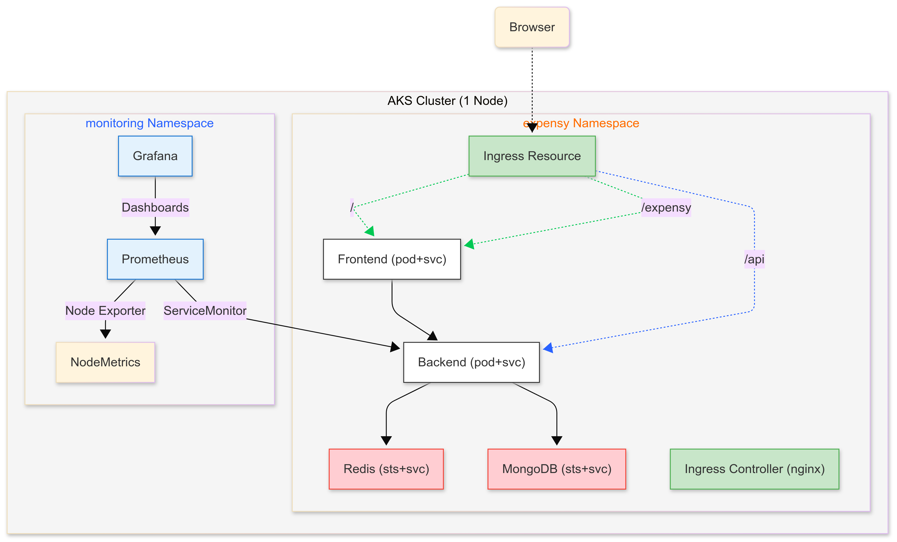

<!-- Final Project: End-to-End DevOps Deployment -->
# DevOps Implementation for Expensy - Expense Tracker App
Set up the entire DevOps cycle for an expense tracking Web Application using acquired best practices.

## Expensy Overview

[Expensy](https://github.com/Pokfinner/expensy) is a full-stack expense tracking application consisting of multiple services built with different languages and technologies, simulating real-world scenarios where various components interact within a microservices architecture. The application includes:

| Component    | Description                                      |
|--------------|--------------------------------------------------|
| Frontend     | Built with **Next.js** – web interface           |
| Backend      | Built with **Node.js/Express** – API logic       |
| MongoDB      | Persistent data storage                          |
| Redis        | In-memory cache for speed                        |

## Objectives
1. Apply DevOps practices to build and manage a full-stack application in a production-grade environment
2. Design and implement a CI/CD pipeline using GitHub Actions to automate application delivery
3. Containerize frontend and backend services using Docker
4. Deploy and orchestrate containerized applications using Kubernetes on Azure Kubernetes Service (AKS) or EKS.
5. Configure NGINX Ingress for routing external HTTP(S) traffic to microservices
6. Set up real-time monitoring and dashboards using Prometheus and Grafana
7. Version control project Architecture diagrams (optional)
<br>

Here is a simplified deployment architecture with one replica for each microservice for presentation purpose.



## Pre-requisites

- Node.js & npm installed
- MongoDB & Redis running (local or containers)
- Docker installed
- Account on the DockerHub registry. This account will be used to host docker images
- Account with any cloud platform of your choice (AWS, Azure or Hybrid), a free-trial or an account with enough credit

## Test running the Web App locally

### 1️⃣ Backend
  ``` 
      npm install
      npm run build
  ```

### 2️⃣ Redis Container
 ```docker run --name redis -d -p 6379:6379   redis:latest   redis-server --requirepass someredispassword```

### 3️⃣ MongoDB Container
```docker run --name mongo -d -p 27017:27017   -e MONGO_INITDB_ROOT_USERNAME=root   -e MONGO_INITDB_ROOT_PASSWORD=example   mongo:latest```

### 4️⃣ Frontend
```
npm install
npm run dev
```
### Environment Variables

- **Frontend**: use `NEXT_PUBLIC_*` for variables that need to be exposed to the browser.
- **Backend**: store secrets like `DATABASE_URI`, `REDIS_PASSWORD`, etc. in a `.env` file or in your CI/CD pipeline secret store. 

Remember that environment variables set in your server take precedence (priority) over the `.env` files.

## Implementation Steps
### Step 1 - 🐳 Dockerized Setup
Containerized the backend and frontend services using Docker. Each Dockerfile defines the build process and runtime for the respective services.
To manage and run all services (frontend,backend, redis, and mongodb) together (**for single-machine deployments**), create a docker-compose.yml file in root directory of the Microservices project. It sets up networks and volumes, ensuring seamless communication between containers.

```docker compose up -d --build```

This will:

Start Redis and Mongodb
Build and run frontend and backend.

Access the Application:
Visit http://localhost:3000 to see the expensy app running in a Dockerized setup.

### Step 2- Infrastructure Setup (IaC)
Automated AKS Cluster deployment via bicep configs:
 1. Create-rg.bicep

 Deploy this at the subscription level:
```
az deployment sub create \
  --location uaenorth \
  --template-file create-rg.bicep
```

2. Create aks-cluster.bicep

Deploy it at the resource group level:
```
az deployment group create \
  --resource-group expensyAksRG \
  --template-file aks-cluster.bicep \
  --parameters sshPublicKey="$(cat ~/.ssh/id_rsa.pub)"
```
If necessary:
``` ssh-keygen -t rsa -b 4096 -f ~/.ssh/id_rsa```

3. Connect to the AKS cluster
```az aks get-credentials --resource-group expensyAksRG --name expensyAksCluster ```

Infrastructure files can be found under `/k8s/infra/`.

### Step 3- Kubernetes Deployment
Create Deployment and Service manifests for each microservice and Statefulsets for MongoDB and Redis. 
Container images are referenced from Docker Hub and environment variables are passed via **Secrets**.
Kubernetes manifests can be found under `k8s/`.

### Step 4- CI/CD Pipeline
 GitHub Actions workflow is defined at:

.github/workflows/CI-pipeline.yaml
.github/workflows/CD-pipeline.yaml

This project uses **GitHub Actions** to automate Docker image build, push and deployment to Kubernetes cluster for both frontend and backend.

### Step 5- Test the Deployed App

Once the CI-CD pipelines runs successfully, confirm:

All Deployments and Pods are running:

```kubectl get deployments -n expensy```
```kubectl get pods,svc -n expensy```

For stateulsets, check if PV is bound:
```kubectl get pvc -n expensy```

The NGINX Ingress provides an external IP or DNS address (if domain is purchased and linked):

```kubectl get ingress -n expensy```

Access the app:
http://<INGRESS_IP> or http://<your-linked-domain>

<p align="left">
  
</p>

Test the flow: Add expense and see if the expense data is stored.

### Step 6- Monitoring & Logging
#### Monitoring Stack
 Configured Prometheus to scrape infrastructure and App metrics.
 - Used Prometheus's node-exporter to scrape system level metrics.
 - Used ServiceMonitor to scrap metrics exposed by backend.

#### Grafana dashboards
Garafana dashboards to visualize infrastructure and App metrics are created and can be found under `/monitoring/`

#### Alerting
Alerts are set up based on business, technical as well as resource usage to proactively respond to issues.
Prometheus is configured with alerting rules to define the conditions under which alerts should be fired and linked to Grafana dashboards.
#### Logging
Cluster nodes and Container logs are available in **Azure Monitor** (AKS).

### Step 7- Security and Compliance
- Secrets are managed via Kubernetes Secrets
- IAM roles used for cloud services access following principle of least privilege (PoLP)
- CI/CD uses Github secrets to store sensitive information
- Deployed project is accessed via Https using trusted certificate issued via Cert Bot/ Cert manager (works only with proper domain names from hostinger, namecheap etc.)
See ```SECURITY.md``` for more

---
### Links
#### Deployed App: [Expensy App Deployment on Aks cluster](http://20.233.201.212/)

#### Infrastructure Monitoring: [Grafana Dashboard to visualize Nodes Metrics](http://74.162.96.12/d/beiyxmcdom58gb/dashboard-expensy-nodes?orgId=1&from=now-6h&to=now&timezone=browser)

#### Backend Monitoring: [Grafana Dashboard to visualize Backend Metrics](http://74.162.96.12/d/fej6zfxedsrnke/dashboard-expensy-backend?orgId=1&from=now-5m&to=now&timezone=browser&refresh=5s)

#### Application Alerts: [Business & Technical Alerts](http://20.174.44.52:9090/alerts)

#### Azure Logging: [Azure Monitor](https://portal.azure.com/#@educationazureironhack.onmicrosoft.com/resource/subscriptions/1ca8d3ea-3b84-49f5-afde-7b4ebe3a62eb/resourceGroups/expensyAksRG/providers/Microsoft.ContainerService/managedClusters/expensyAksCluster/monitor)

#### Git: [Github repository Link](https://github.com/najjaved/devOps-expense-tracker-app)

